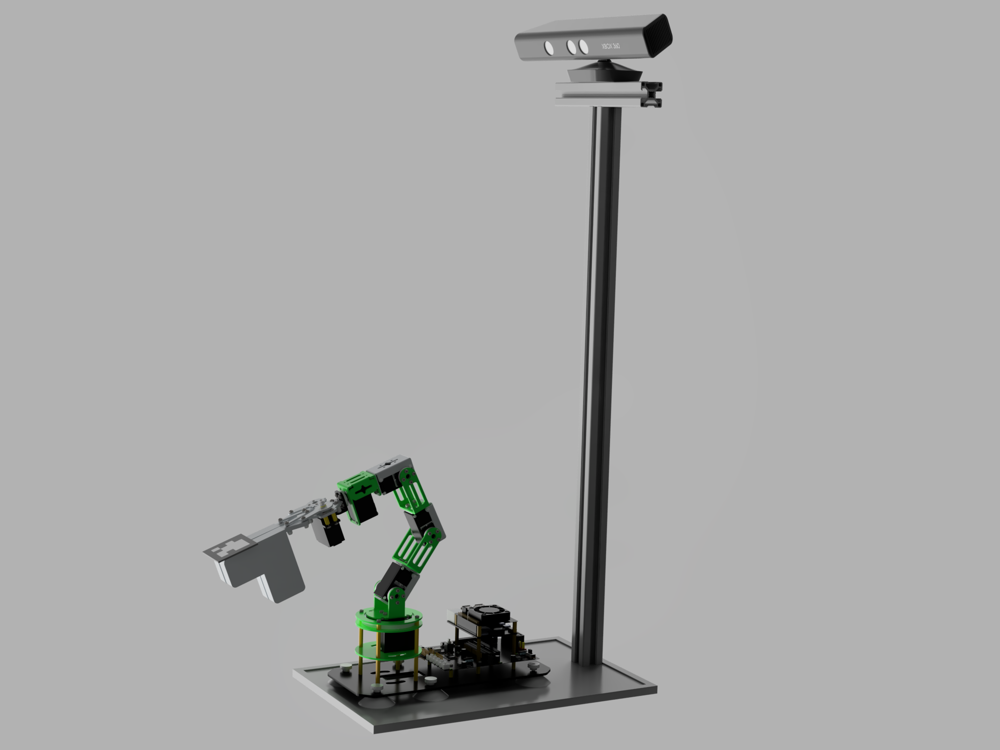
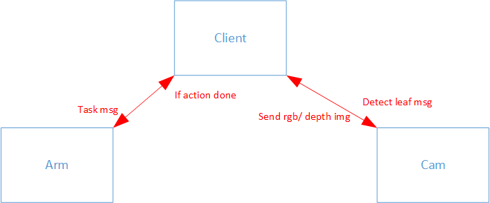

### Welcome to LeafBot


#### To install the environment:
1. Install virtualenv:
    ```sh
    conda create --name leafbot --file requirements.txt
    ```
2. Activate the environment in Jupyter notebook:
    ```sh
    conda activate leafbot
    jupyter notebook
    ```

#### Program Structure
There are **three** branches of code:
- **client:** The Local server to communicate between the robot arm and the camera
- **arm:** This branch includes all the functions using for the robot, it communicates with the local server in the pair mode. It can send and receive message from local server. 
- **cam:** The Kinect 360Xbox driven by freelibnect sends the rgb image to client in real-time in sub/pub mode. And it can send the depth image when client requests for it.

#### Demonstration of communication
In this project, the communication among the hardware is implemented by [ZeroMQ](https://zeromq.org/languages/python/) (click the link for more information).
